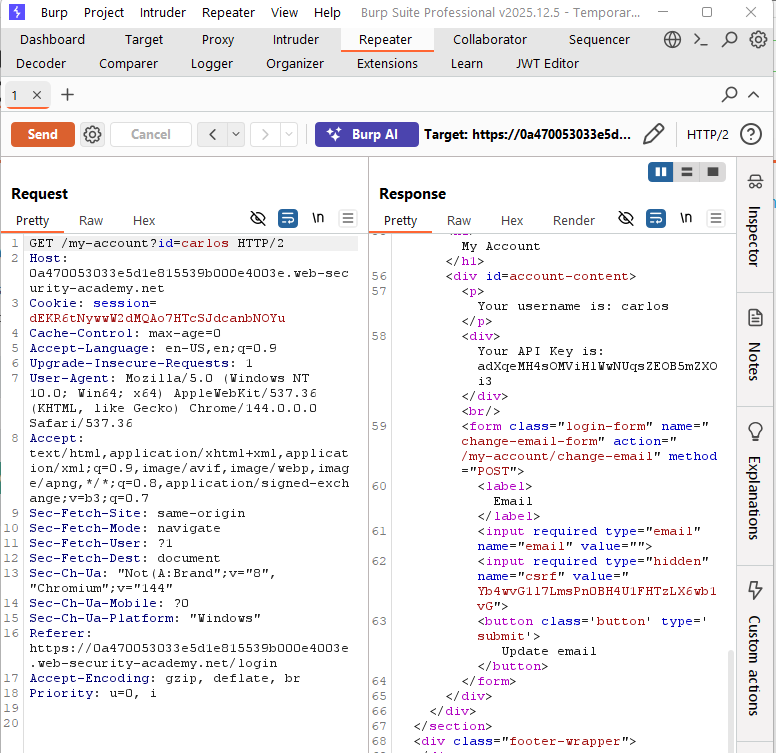

# User ID Controlled by Request Parameter

## Context
This write-up evaluates a PortSwigger lab demonstrating an OWASP Broken Access Control vulnerability in a user account feature, analyzed from a development lifecycle perspective.

## What are we doing?
The application allows logged-in users to view data associated with their own accounts. The system is responsible for ensuring that users cannot access data that belongs to other users.

## What can go wrong?
If the application uses a user ID from the request to determine which account data to return, a logged-in user could modify that ID and access another user’s data, thereby breaking access controls.

This was tested while logged in by modifying the user ID in the request used to retrieve account data. The application returned data belonging to a different user, confirming that the server's access controls were not enforced.

## How do we fix it?
The problem is that the server is allowing the client to say, “Show me this user’s data.” Instead, the server should determine which account the request belongs to based on the logged-in user.

The server should ignore any user ID sent in the request and use the authenticated session or token to determine which account data to return. Even if someone changes the user ID in the request, the server should still only return data for the logged-in user. If an endpoint allows access by user ID, such as for administrators, the server must verify that the logged-in user is authorized to access that account.

## Did we fix it, and did we do it well?
Because the application code cannot be modified in this lab, the fix cannot be validated directly. In a real system, the fix would be considered successful if changing the user ID in the request no longer returns data for another user. Testing should explicitly attempt cross-user access to confirm that authorization is enforced server-side.

## Where in the lifecycle did this fail, and where should it have been caught?
The failure occurred in the requirements phase, where it was not clearly defined that users should only be able to access their own data. It continued into the design phase, where the system allowed the client to influence which user’s data was returned instead of enforcing authorization server-side. This decision was carried into development, where authorization checks were not implemented. The issue should have been caught during testing through negative test cases that attempted cross-user access. Deployment did not introduce the problem, and during maintenance and monitoring, there were no controls in place to detect unauthorized access attempts.
